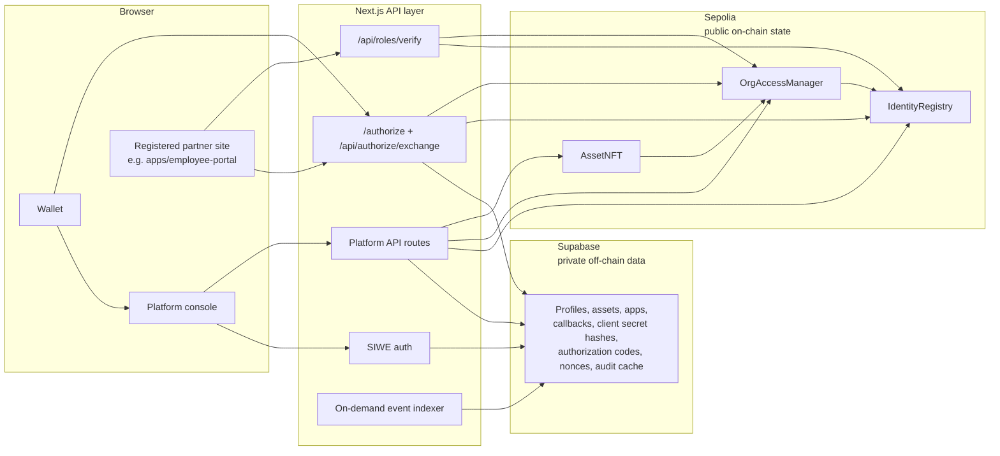
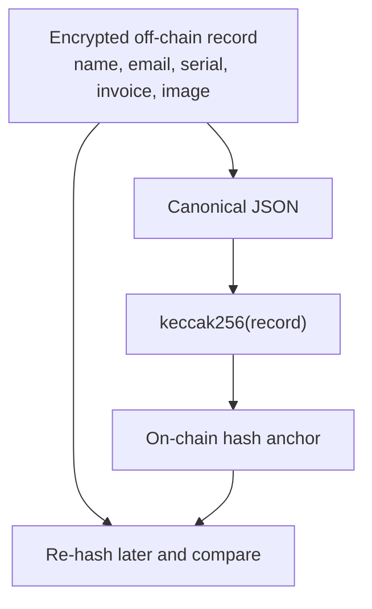
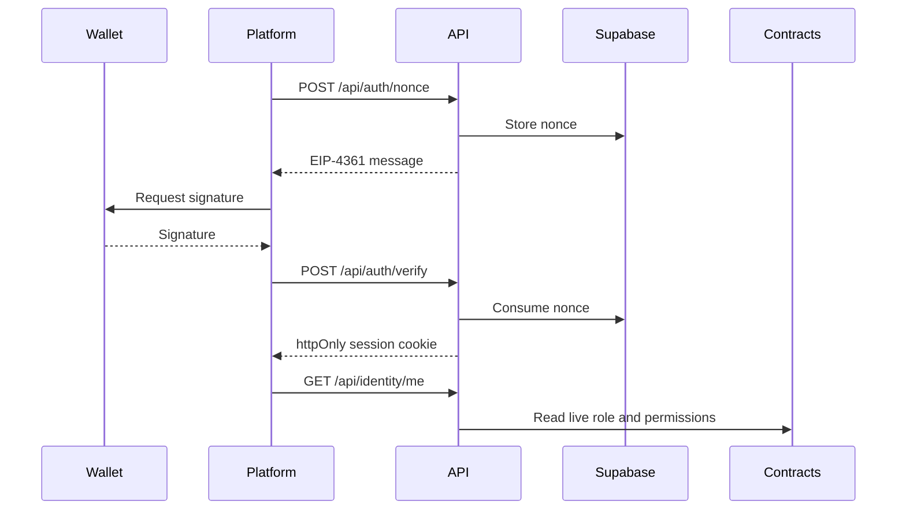
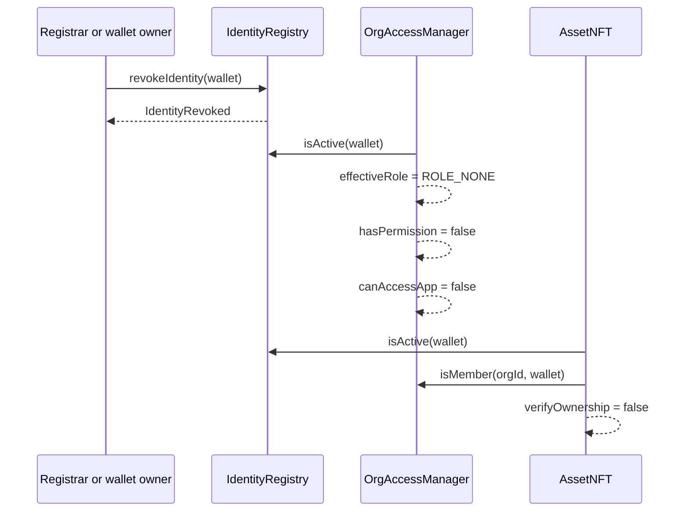

# OwneX

**Own it. Prove it.**

OwneX is a Sepolia testnet proof of concept for wallet-bound identity,
organization roles, and NFT-backed asset custody. It keeps personal records
off-chain, stores only hashes and authorization state on-chain, and lets an
application ask "is this wallet allowed?" without trusting a private database as
the authority.

```text
3 contracts on Sepolia
93 contract tests
86 API assertions
13 documented API endpoint groups
```

This is not audited, not production ready, and not safe for anything valuable.

## Why It Exists

Most identity and asset systems put the sensitive record and the authorization
decision in the same editable database. OwneX splits them:

- Supabase stores encrypted profiles, asset details, images, and cached audit
  rows.
- Sepolia stores wallet-bound identity state, organization membership, role
  expiry, app access, token custody, and `keccak256` anchors.
- The API joins those two worlds, but it does not become the source of truth for
  roles or ownership.

The strongest behavior is revocation. One `revokeIdentity` transaction makes
dependent reads return no role, no permission, no app access, and no valid asset
ownership verification.

## Sepolia Deployment

Sepolia is the only deployed network recorded in this repository.

| Contract | Address | Etherscan |
|---|---|---|
| `IdentityRegistry` | `0x0Ea36bBdB169957a9a12039E5cbCC677de5Fa8EC` | [Etherscan](https://sepolia.etherscan.io/address/0x0Ea36bBdB169957a9a12039E5cbCC677de5Fa8EC) |
| `OrgAccessManager` | `0xb035648279247A82F298CBA4Eef364FaDa17B14F` | [Etherscan](https://sepolia.etherscan.io/address/0xb035648279247A82F298CBA4Eef364FaDa17B14F) |
| `AssetNFT` | `0x5e07bFDa18281ea3038E1AdCa27ff4aAe5dB37BA` | [Etherscan](https://sepolia.etherscan.io/address/0x5e07bFDa18281ea3038E1AdCa27ff4aAe5dB37BA) |

Deployment and seeded-demo transaction evidence is recorded in
[`read/phase-7-sepolia.md`](read/phase-7-sepolia.md). The generated deployment
JSON remains local and is intentionally ignored by Git.

Source-code verification on Etherscan was attempted during Phase 7 and timed out.
Retry with:

```bash
npm run verify:sepolia
```

## Architecture

The complete source diagrams are in
[`read/architecture.md`](read/architecture.md). A timed recording script is in
[`read/demo-script.md`](read/demo-script.md). The core trust boundary is:



Personal data is on the API/Supabase side. Sepolia holds public addresses,
roles, expiries, token state, events, metadata URIs, and hashes.

### On-Chain Versus Off-Chain



A match means the off-chain record still matches the anchor. A mismatch means
the private record was changed or bound incorrectly. The chain does not contain
the private fields.

### Sign-In



The signature is gas-free. The session stores the wallet, not the role, so role
checks can reflect revocation on the next request.

### Revocation Cascade



## What Is Built

| Area | Status |
|---|---|
| Contracts | Built and deployed to Sepolia: identity registry, org access manager, asset NFT. |
| Platform app | Built in `apps/platform`: landing page, design system, console, API routes, Supabase integration, SIWE auth. |
| Sign in with OwneX | Built: a generic authorization-code flow any *registered* third-party website can use. `/authorize` → consent → single-use 2-minute code → `/api/authorize/exchange` with a per-application client secret. See [`docs/sign-in-with-ownex.md`](docs/sign-in-with-ownex.md). |
| Application registry | Built: per-application client id, hashed client secret, exact callback URLs, allowed roles, revocation, and a five-step integration status pipeline on `/dashboard/applications`. |
| Cross-app authorization endpoint | Built: `/api/roles/verify` reads live chain state, fails closed, returns no private profile data, and requires the partner's client credentials in production. Unauthenticated access is a documented development-only mode. |
| Employee Portal | Built in `apps/employee-portal` as the reference integration: its own client id and secret from its environment, `state` verification, server-side code exchange, and live revalidation on every request. |

## Security Evidence

Detailed claim-to-test mapping lives in
[`read/evidence.md`](read/evidence.md).

| Property | Evidence |
|---|---|
| A plain `USER` cannot mint. | `test/asset.test.ts:120`, `MissingPermission`. |
| Holder transfers are locked. | `test/asset.test.ts:200`, `TransfersLocked`. |
| Approved operators are also blocked. | `test/asset.test.ts:214` and `test/asset.test.ts:223`. |
| Self-promotion is blocked. | `test/access.test.ts:177`, including an admin targeting itself. |
| Admin governance cannot be disabled. | `test/access.test.ts:391`, `CannotDisableAdminGovernance`. |
| Revocation removes role and permissions. | `test/access.test.ts:405`. |
| Revocation removes app access. | `test/access.test.ts:460`. |
| Revocation breaks ownership verification. | `test/asset.test.ts:341`. |
| Role expiry is automatic. | `test/access.test.ts:229`. |
| Hash tampering is detected. | `test/identity.test.ts:173` and `test/asset.test.ts:371`. |

API verification is performed by `apps/platform/scripts/verify-api.mjs` against a
live seeded stack. It checks real SIWE signatures, nonce replay rejection,
protected-route 401s, least-privilege behavior, metadata privacy, application
access, and `/api/roles/verify`.

## API Surface

The project documents 13 endpoint groups:

| Route | Auth | Purpose |
|---|---|---|
| `POST /api/auth/nonce` | Public | Issue a single-use signing challenge. |
| `POST /api/auth/verify` | Public | Verify signature, consume nonce, set session. |
| `POST /api/auth/logout` | Session | Destroy session. |
| `GET /api/identity/me` | Session | Identity, memberships, permissions, held assets. |
| `GET /api/roles/verify` | Public | Integration endpoint for partner apps. |
| `GET /api/profile`, `PUT /api/profile` | Session | Read/update own private profile and compute anchor hash. |
| `GET /api/assets` | Member | List org assets, joining chain and database data. |
| `POST /api/assets` | `MINT_ASSETS` | Draft asset, return `assetHash`, `metadataUri`, and mint args. |
| `POST /api/assets/[id]/confirm` | `MINT_ASSETS` | Bind draft to token only if the on-chain hash matches. |
| `GET /api/metadata/[ref]` | Public | ERC-721 metadata JSON. |
| `GET /api/audit` | `VIEW_AUDIT` | Paged audit history with explorer links. |
| `POST /api/audit/sync` | Session | Run the event indexer on demand. |
| `GET /api/health` | Public | Config, chain, contract, and database reachability. |

`/api/roles/verify` is intentionally unauthenticated in this proof of concept.
A production version should issue a revocable API key per integrated
application.

Example:

```http
GET /api/roles/verify?wallet=0x...&orgId=1&app=employee-portal
```

The response reports `allowed`, `role`, `reason`, selected permission booleans,
identity state, organization state, membership expiry, and app access.

## Run Locally

### Docker (recommended)

Requires [Docker Desktop](https://www.docker.com/products/docker-desktop/).
After forking or cloning, this one command installs all root and app dependencies
inside Docker, compiles and deploys the contracts to a local Hardhat chain, seeds
the demo, and starts both apps—nothing is installed on the host:

```bash
git clone https://github.com/<your-user>/owneX.git
cd owneX
docker compose up
```

Open the platform at http://localhost:3000 and the employee portal at
http://localhost:3001. The local JSON-RPC is http://localhost:8545 (chain ID
`31337`). Stop the stack with `docker compose down`; include `-v` to also remove
cached dependency volumes.

The first run creates `.env`, `apps/platform/.env.local`, and
`apps/employee-portal/.env.local` from their example files. Add real Supabase
values to `apps/platform/.env.local` before using Supabase-backed features, then
rerun the optional off-chain seed:

```bash
docker compose run --rm deployer npm run seed:offchain
```

Prebuilt production images are published on Docker Hub. From a clone with the
same environment files, pull and run them with:

```bash
docker compose -f docker-compose.prod.yml pull
docker compose -f docker-compose.prod.yml up -d
```

### Without Docker

Prerequisites:

- Node.js and npm
- A Supabase project for the platform database and storage
- MetaMask or another EIP-1193 wallet for browser testing

Install and compile:

```bash
git clone https://github.com/SWADHIN300/owneX.git
cd ownex
npm install
npm run compile
npm test
```

Create local environment files from the examples. Do not commit real values.

```bash
cp .env.example .env
cp apps/platform/.env.local.example apps/platform/.env.local
```

Generate secrets:

```bash
node -e "console.log(require('crypto').randomBytes(32).toString('base64url'))"
node -e "console.log(require('crypto').randomBytes(32).toString('hex'))"
```

Use the first value for `SESSION_PASSWORD` and the second for
`PII_ENCRYPTION_KEY`. The PII key cannot be changed after data exists without
making encrypted rows unreadable.

Apply `supabase/schema.sql` in the Supabase SQL editor once, then apply
`supabase/migrations/0001_generic_sso.sql` (idempotent, and needed on an existing
database to add the "Sign in with OwneX" client credentials, callback table and
generic authorization codes). Then run the local stack:

```bash
# terminal 1
npm run dev:chain

# terminal 2
npm run seed:all
npm run dev:platform
```

Open the platform at http://localhost:3000.

To run the Employee Portal as the reference "Sign in with OwneX" integration,
provision its credentials and copy the printed block into
`apps/employee-portal/.env.local`:

```bash
cd apps/platform
npm run provision:app -- --slug employee-portal --name "Employee Portal" \
  --url http://localhost:3001 --callback http://localhost:3001/callback \
  --roles ADMIN,MANAGER,AUDITOR,USER --org 1
```

Then sign `registerApplication` and `setAppAccess` from
`/dashboard/applications`, and start the portal with `npm run dev:portal`. Full
detail is in [`docs/sign-in-with-ownex.md`](docs/sign-in-with-ownex.md).

Local wallet network:

```text
Network name  Hardhat Local
RPC URL       http://127.0.0.1:8545
Chain ID      31337
Currency      ETH
```

## Verification Commands

From the repository root:

```bash
npm test
npm run verify:api
```

For the platform app:

```bash
cd apps/platform
npm run check:contrast
npm run typecheck
npm run lint
npm run build
npm run check:overflow
```

The prompt for Phase 8 also asks for employee portal checks. Those cannot be run
from this checkout because `apps/employee-portal` is absent.

## Deployment Notes

The platform is a Next.js app under `apps/platform` and can be deployed to Vercel
or an equivalent host. Set every environment variable in the host dashboard, not
in the repository.

Before public deployment:

- Keep `SUPABASE_SERVICE_ROLE_KEY`, `SESSION_PASSWORD`, `PII_ENCRYPTION_KEY`,
  `DEPLOYER_PRIVATE_KEY`, RPC credentials, and API keys out of client-visible
  variables.
- Set `NEXT_PUBLIC_APP_URL` to the final public platform URL so manifest and
  social metadata resolve against the deployed origin.
- Point `CHAIN_ID`, `RPC_URL`, contract addresses, and public explorer settings
  at Sepolia if using the recorded deployment.
- Re-run `npm run verify:sepolia` when Etherscan is reachable.
- Verify icons, the web manifest, and Open Graph image on the deployed platform.
- Check both themes and a 390px viewport on the deployed site.
- Confirm any production portal URL is allowlisted before using cross-app login.

The separate employee portal cannot be deployed from this repository until that
app exists.

## Repository Layout

```text
ownex/
  contracts/          IdentityRegistry, OrgAccessManager, AssetNFT
  test/               93 contract tests
  scripts/            deploy, seed, Sepolia preflight/verify/config
  supabase/           schema.sql, migrations/
  docs/               sign-in-with-ownex.md — the integration guide
  deployments/        local and Sepolia deployment/seed artifacts
  apps/platform/      Next.js platform, API routes, scripts, UI
  apps/employee-portal/  reference "Sign in with OwneX" partner integration
  read/               phase notes, architecture, evidence, demo script
```

## Limitations

- Sepolia testnet only. No mainnet deployment is recorded.
- No external security review has been carried out.
- Not production ready and not safe for valuable assets or real identities.
- No end-user key recovery yet. The guardian model is designed, not built.
- Losing a wallet can still mean losing access unless a registrar reissues or an
  org root admin transfers control.
- `/api/roles/verify` is intentionally unauthenticated in this PoC. Production
  should issue a revocable API key per integrated application.
- No rate limiting on public auth or role endpoints.
- The indexer runs on demand, not as a worker or cron job.
- Supabase service role key rotation is required before going live.
- Single-admin organizations are a central point of failure. Production should
  use a multisig as root admin.
- The chain proves wallet/token state and hash agreement. It does not prove legal
  ownership of a physical item.
- Zero-knowledge selective disclosure, ERC-4337 paymasters, Merkle batching, and
  NFC/QR physical binding are planned ideas only; they are not built here.

## License

MIT
