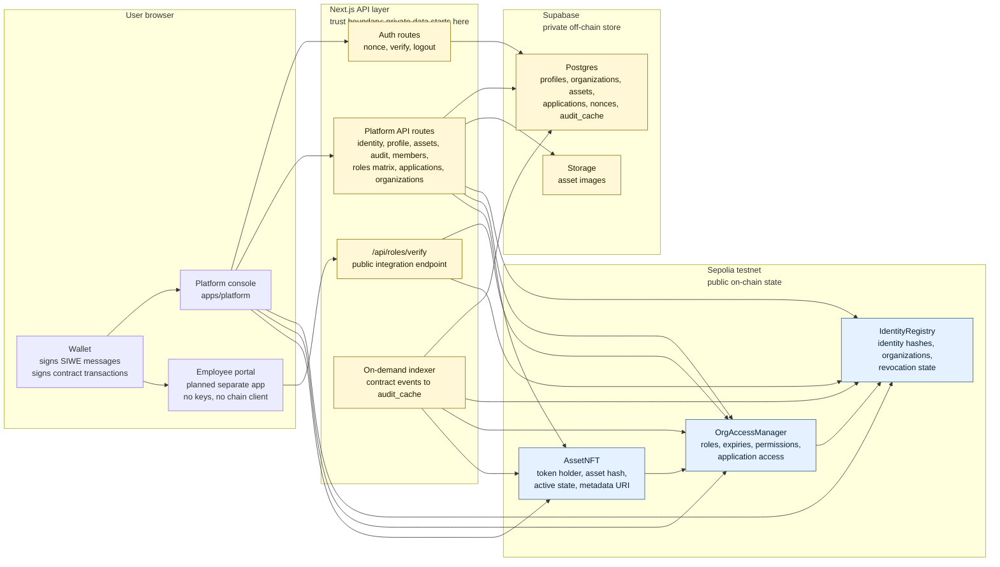
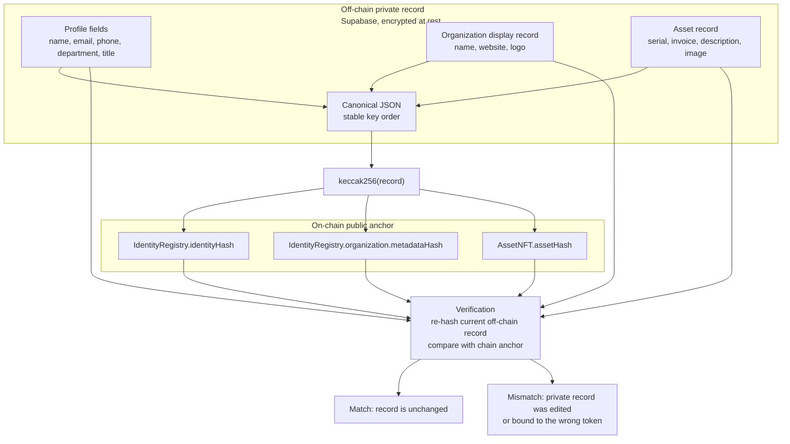
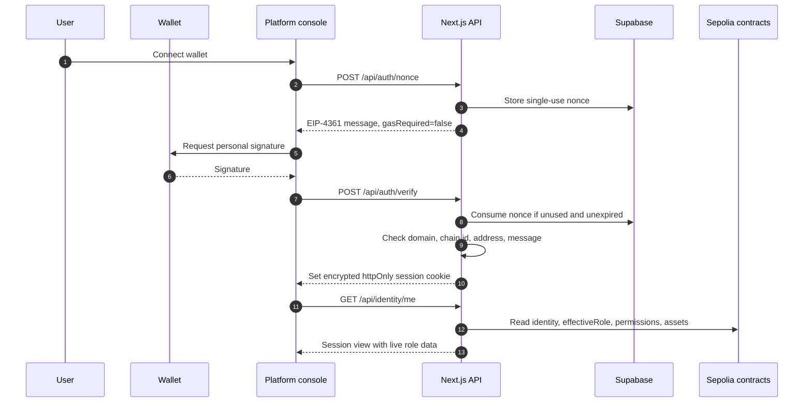
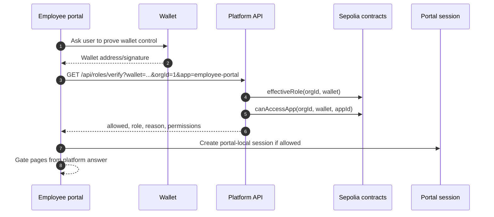
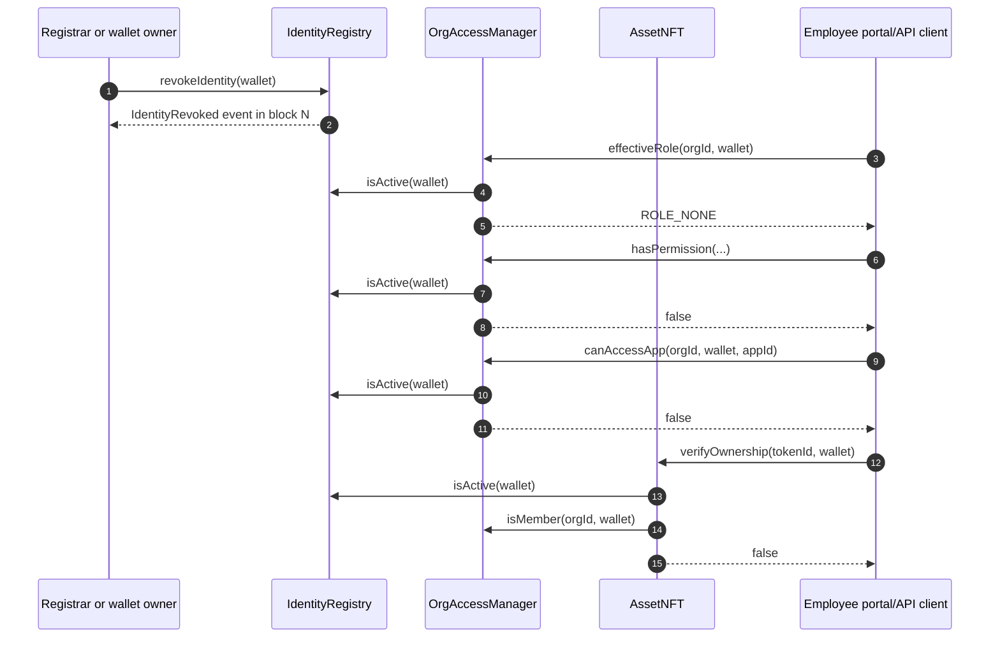

# OwneX Architecture Diagrams

These diagrams are source, not screenshots. GitHub renders Mermaid blocks, and
the raw Markdown stays diffable.

## System Architecture

Personal data stays on the API and Supabase side of the boundary. Sepolia holds
only public wallet addresses, roles, token state, timestamps, metadata URIs, and
`keccak256` hashes of private records.

## On-Chain Versus Off-Chain Split

The privacy claim is limited and concrete: the chain can prove whether an
off-chain record changed, but the chain does not contain the profile or asset
details themselves.

## Sign-In Sequence

Signing in is gas-free because the wallet signs a message. Role checks after
sign-in still read from the contracts, so revocation is not delayed by cached
roles in the cookie.

## Cross-App Authorization Sequence

The portal is meant to hold no private keys and touch no blockchain provider. It
delegates the authorization question to `/api/roles/verify`. In this checkout,
the platform endpoint and seeded application exist, but the separate portal app
is not present.

## Revocation Cascade

The revocation transaction writes only to `IdentityRegistry`. The cascade happens
because every dependent read checks identity liveness before returning a role,
permission, app access decision, or ownership verification.
